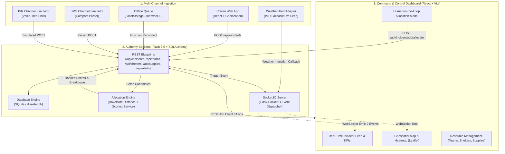

# Aapda-Saarthi (आपदा सारथी)
### Real-Time Disaster Early-Warning & Resource Coordination Platform

[](https://www.python.org/)
[](https://flask.palletsprojects.com/)
[](https://reactjs.org/)
[](https://vitejs.dev/)
[](https://tailwindcss.com/)
[](https://socket.io/)
[](https://www.sqlite.org/)
[]()

> **PS-05:** Real-Time Disaster Early-Warning & Resource Coordination Platform  
> **Theme:** Disaster Management | **Category:** Software

Aapda-Saarthi is an end-to-end disaster management platform designed to bridge critical information gaps during emergencies. It unifies multi-channel citizen reporting (Web, SMS, IVR), real-time authority command dashboards, GIS-powered spatial mapping, and an explainable, deterministic resource allocation engine to deliver rapid, coordinated disaster response.

---

## Table of Contents

- [Problem Statement (PS-05)](#problem-statement-ps-05)
- [How This Project Solves It](#how-this-project-solves-it)
- [System Architecture & Data Flow](#system-architecture--data-flow)
- [Real-Time Socket.IO Events](#real-time-socketio-events)
- [Allocation Engine & Scoring Logic](#allocation-engine--scoring-logic)
- [Sustainability & Resilience](#sustainability--resilience)
- [Tech Stack](#tech-stack)
- [Repository Structure](#repository-structure)
- [API Reference](#api-reference)
- [Local Setup & Quick Start](#local-setup--quick-start)
  - [Prerequisites](#prerequisites)
  - [1. Backend Setup](#1-backend-setup)
  - [2. Frontend Setup](#2-frontend-setup)
  - [3. Integrations & Simulators](#3-integrations--simulators)
  - [Running the Test Suites](#running-the-test-suites)
  - [Verifying End-to-End System Integration](#verifying-end-to-end-system-integration)
- [Development Model & Governance](#development-model--governance)
- [Known Limitations & Roadmap](#known-limitations--roadmap)
- [License](#license)

---

## Problem Statement (PS-05)

**PS-05 — Real-Time Disaster Early-Warning & Resource Coordination Platform**  
*Category: Software | Theme: Disaster Management*

> During floods, cyclones, landslides and other disasters, delayed information flow between citizens, emergency response teams, NDRF/local rescue teams, shelters, relief organizations, local administration and disaster management authorities can result in:
> - **Delayed rescue operations**
> - **Poor resource allocation**
> - **Resources being sent to unsuitable locations**
> - **Lack of visibility into available rescue teams**
> - **Lack of shelter-capacity information**
> - **Uneven distribution of relief supplies**
> - **Important citizen reports being missed**
> - **Difficulty identifying areas with high incident concentration**
> - **Poor communication in low-internet areas**

The core question the project answers:  
**When a disaster happens, how quickly can scattered information be brought together and converted into an actionable response?**

---

## How This Project Solves It

Aapda-Saarthi tackles each failure mode of disaster coordination through tightly integrated, resilient modules:

```
[ Citizen (Web / Offline Queue) ] ──┐
[ Citizen (SMS Fallback Channel) ]  ┼─► [ Unified REST API ] ─► [ SQLite DB ] ─► [ Socket.IO Broadcast ]
[ Citizen (IVR Voice Simulator) ]  ─┘          │                                         │
                                                ▼                                         ▼
                                     [ Allocation Engine ]                     [ Authority Dashboard ]
                                   (Proximity + Suitability)                   (Live Feed + Map + KPIs)
                                                │                                         │
                                                └───────────► [ Human Approval ] ◄────────┘
                                                               (Confirm Dispatch)
```

| Problem Identified in PS-05 | Platform Solution & Implementation |
|---|---|
| **Important citizen reports being missed** | **Multi-Channel Ingestion:** Web reporting with auto-GPS capture, client-side photo compression, and immediate queueing. |
| **Poor communication in low-internet areas** | **Low-Bandwidth Fallbacks:** Browser-side offline queue (`localStorage` with auto-sync upon reconnection), compact comma-separated SMS parser (`TYPE,SEVERITY,LAT,LON,DESC`), and interactive IVR voice-call simulator. |
| **Lack of visibility into available rescue teams** | **Live Team Tracking:** Dedicated rescue team management tracking team types (`FLOOD_RESCUE`, `MEDICAL`, `FIRE`, `LANDSLIDE_RESCUE`, `ROAD_CLEARANCE`, `GENERAL_RESCUE`), statuses (`AVAILABLE`, `BUSY`, `EN_ROUTE`, `ON_SITE`, `OFFLINE`), headcounts, and live coordinates. |
| **Lack of shelter-capacity information** | **Shelter Capacity Gauges:** Real-time shelter status tracking total capacity, current occupancy, remaining capacity percentage, and operational state (`OPEN`, `FULL`, `CLOSED`). |
| **Uneven distribution of relief supplies** | **Supply Center Inventory:** Real-time monitoring of essential inventory (`food_packets`, `water_units`, `medical_kits`, `blankets`) and stock alerts (`AVAILABLE`, `LOW`, `DEPLETED`). |
| **Poor resource allocation & unsuitable dispatch** | **Explainable Allocation Engine:** Evaluates candidate rescue teams using domain suitability rules (e.g., flood teams to flood incidents) and a 4-factor deterministic scoring formula. |
| **Delayed rescue operations** | **Sub-Second Real-Time Updates:** WebSocket event emission (`Flask-SocketIO`) pushes updates to all authority dashboard clients instantly without polling or page refreshes. |
| **Difficulty identifying incident concentration** | **Interactive Geospatial Visualization:** Leaflet map visualizes all entities with severity-coded markers and a toggleable, intensity-weighted disaster heatmap layer. |

---

## System Architecture & Data Flow

Aapda-Saarthi follows a modular, 3-tier architecture with clean boundaries:



---

## Real-Time Socket.IO Events

The backend exposes a Socket.IO gateway with 7 standard events. The frontend authority dashboard listens to these events to update maps, metrics, and feeds without page reloading:

| Event Name | Sender | Trigger Condition | Payload Details |
|---|---|---|---|
| `new_incident` | Backend | New citizen incident created (`POST /api/incidents`) | Incident ID, type, severity, coordinates, description, photo path, timestamp |
| `incident_updated` | Backend | Incident status mutation (`REPORTED` → `VERIFIED` → `ASSIGNED` → `IN_PROGRESS` → `RESOLVED`) | Incident ID, updated status, timestamp |
| `team_assigned` | Backend | Human authority confirms team allocation (`POST /api/incidents/<id>/allocate`) | Incident ID, team ID, team name, distance (km), allocation score, reasoning |
| `team_status_changed` | Backend | Team changes state (`AVAILABLE`, `EN_ROUTE`, `ON_SITE`, `BUSY`, `OFFLINE`) | Team ID, new status, updated coordinates, timestamp |
| `shelter_updated` | Backend | Shelter occupancy or capacity modified | Shelter ID, occupied count, available capacity, status (`OPEN`/`FULL`/`CLOSED`) |
| `supply_updated` | Backend | Supply center inventory changed | Supply ID, counts (food, water, medical kits, blankets), status |
| `weather_alert` | Integrations / Backend | Ingestion of official weather or disaster warnings | Alert ID, alert type, severity, affected area, coordinates, source, duration |

---

## Allocation Engine & Scoring Logic

The resource recommendation engine (`backend/services/allocation_service.py`) automates candidate ranking while maintaining **100% human-in-the-loop authority**.

### 1. Suitability & Availability Filtering
Before scoring, the pool of rescue teams is filtered:
1. **Status check:** Team must be `AVAILABLE` (non-busy, online).
2. **Team type compatibility:** Team type must match the incident type via domain compatibility mapping:
   - `FLOOD` → `FLOOD_RESCUE`, `GENERAL_RESCUE`
   - `TRAPPED_PERSON` → `FLOOD_RESCUE`, `LANDSLIDE_RESCUE`, `GENERAL_RESCUE`
   - `LANDSLIDE` → `LANDSLIDE_RESCUE`, `GENERAL_RESCUE`
   - `CYCLONE` → `GENERAL_RESCUE`, `FLOOD_RESCUE`
   - `FIRE` → `FIRE`, `GENERAL_RESCUE`
   - `ROAD_BLOCK` → `ROAD_CLEARANCE`, `GENERAL_RESCUE`
   - `MEDICAL` → `MEDICAL`
   - `BUILDING_DAMAGE` → `GENERAL_RESCUE`, `FIRE`
3. **Capacity check:** Team must have active members ($\text{members} > 0$).

### 2. Weighted Scoring Formula
For all eligible teams, geographic Haversine distance is calculated between the incident and team coordinates. The final recommendation score ($0\text{--}100$) is computed as:

$$\text{Score} = (0.40 \times S_{\text{proximity}}) + (0.20 \times S_{\text{availability}}) + (0.15 \times S_{\text{capacity}}) + (0.25 \times S_{\text{priority}})$$

Where:
- **Proximity Score ($S_{\text{proximity}}$):** Linear decay from $100$ at $0\text{ km}$ to $0$ at $\ge 25\text{ km}$:
  $$S_{\text{proximity}} = \max\left(0, 100 \times \left(1 - \frac{\text{distance\_km}}{25.0}\right)\right)$$
- **Availability Score ($S_{\text{availability}}$):** $100.0$ for active `AVAILABLE` teams.
- **Capacity Score ($S_{\text{capacity}}$):** Scaled linearly based on team headcount (reference benchmark: $6\text{ members} = 100$):
  $$S_{\text{capacity}} = \min\left(100, 100 \times \frac{\text{members}}{6}\right)$$
- **Incident Priority Score ($S_{\text{priority}}$):** Fixed weight derived from incident severity (`CRITICAL` = 100, `HIGH` = 75, `MEDIUM` = 50, `LOW` = 25).

### 3. Human Governance
The allocation engine **only provides recommendations** with clear score breakdowns and natural language justifications. Dispatch only occurs when an authority clicks **Approve / Confirm**, which calls `POST /api/incidents/<id>/allocate`.

---

## Sustainability & Resilience

Aapda-Saarthi was engineered from first principles for durability in actual disaster scenarios:

- **Low-Resource & Low-Cost Infrastructure:**  
  Built with lightweight Flask and SQLite (with clean migration pathways to PostgreSQL/PostGIS). It operates with negligible memory overhead and zero external paid API dependencies, allowing local administrative bodies with constrained budgets to run it on existing hardware or minimal cloud instances.
- **Low-Bandwidth & Zero-Connectivity Resilience:**  
  - **Browser Offline Queue:** Citizen reports are stored in local browser storage if the device loses connection. The client monitors connection status and automatically flushes the queue upon reconnection (`useOfflineQueueFlush`).
  - **Client-Side Image Compression:** Photos are compressed locally using an offscreen HTML5 canvas before transmission to conserve mobile data bandwidth.
  - **SMS Reporting Channel:** In zones with cellular voice/SMS only and no mobile data, citizens can send standardized SMS text reports parsed into identical JSON structures.
  - **IVR Voice Hotline:** Interactive voice response simulator guides callers through a DTMF phone tree to capture structured incident data over phone lines.
- **Explainability & Institutional Auditability:**  
  Unlike black-box AI models, the deterministic allocation formula produces transparent mathematical score breakdowns that can be reviewed, verified, and audited by administrative supervisors.
- **Extensibility & Production Roadmap:**  
  The codebase features strict separation between core business logic and adapters, allowing simple drop-in upgrades for real SMS/IVR telecom gateways (Twilio, Gupshup), PostGIS spatial indexes, and IMD/NDMA satellite feeds.
- **Honest Assessment of Current Scope:**  
  - *Database:* SQLite is ideal for demonstration and single-server deployments; production high-concurrency environments should configure PostgreSQL.
  - *Telecom:* SMS and IVR are implemented as fully validated local simulator modules ready to be bound to external carrier webhooks.
  - *Weather:* Default mode uses verified regional sample alerts (`sample_alerts.json`) with an automated polling hook ready for live IMD/OpenWeather API keys.

---

## Tech Stack

| Layer | Technology | Purpose & Implementation |
|---|---|---|
| **Frontend Core** | React 18, TypeScript, Vite 5 | Fast, type-safe single-page application with responsive layouts |
| **Styling & UI** | Tailwind CSS 3.4, Lucide Icons | Clean, high-contrast accessible design system for emergency operations |
| **Geospatial & Maps** | Leaflet 1.9, React-Leaflet, Leaflet.heat | Interactive maps, customized severity markers, and heatmap clustering |
| **Backend Core** | Python 3.10+, Flask 3.0, Werkzeug | REST API, request validation, static asset & photo delivery |
| **Database & ORM** | SQLite 3, Flask-SQLAlchemy 3.1 | Authoritative relational data persistence for incidents, teams, shelters, and supplies |
| **Real-Time Layer** | Flask-SocketIO 5.3, Socket.IO Client 4.7 | Bidirectional WebSocket event distribution (`async_mode="threading"`) |
| **Integrations** | Python `requests`, `python-dotenv` | SMS parser, IVR simulator, weather adapter, and offline sync engines |
| **Testing** | Pytest 8.2 (Backend/Integrations), Vitest 2.0 (Frontend) | Unit and integration test suites covering calculations, contracts, and components |

---

## Repository Structure

```
Aapda-Saarthi/
├── README.md                      # Master repository documentation (this file)
├── render.yaml                    # Cloud deployment blueprint (Render)
├── .python-version                # Python runtime pin (3.11)
│
├── backend/                       # Flask REST API + Allocation Engine
│   ├── app.py                     # App factory, blueprints, static uploads & socket init
│   ├── config.py                  # Environment-driven app configuration
│   ├── extensions.py              # Shared SocketIO instance & typed emit helpers
│   ├── seed.py                    # Database seeder (loads sample CSVs and alerts)
│   ├── requirements.txt           # Python dependencies
│   ├── .env.example               # Backend environment template
│   ├── database/                  # SQLite storage directory (disaster.db)
│   ├── data/                      # Initial seed datasets (incidents, teams, shelters, supplies)
│   ├── models/                    # SQLAlchemy models & enum constants
│   │   ├── __init__.py            # Shared db instance & enum constants
│   │   ├── incident.py            # Incident data model
│   │   ├── team.py                # Rescue team data model
│   │   ├── shelter.py             # Shelter data model
│   │   ├── supply.py              # Relief supply center data model
│   │   └── alert.py               # Weather & disaster alert model
│   ├── routes/                    # Flask route blueprints
│   │   ├── health.py              # /api/health endpoint
│   │   ├── incidents.py           # /api/incidents CRUD & /allocate endpoints
│   │   ├── teams.py               # /api/teams CRUD
│   │   ├── shelters.py            # /api/shelters CRUD
│   │   ├── supplies.py            # /api/supplies CRUD
│   │   ├── alerts.py              # /api/alerts CRUD
│   │   └── dashboard.py           # /api/dashboard/stats & /map-data aggregations
│   ├── services/                  # Business logic services
│   │   ├── allocation_service.py  # Deterministic resource allocation engine
│   │   ├── geo_utils.py           # Haversine distance calculations
│   │   ├── incident_service.py    # Validation & incident creation logic
│   │   └── alert_service.py       # Weather alert ingestion logic
│   └── tests/                     # Pytest backend test suite (31 tests)
│
├── frontend/                      # Frontend workspace
│   └── frontend/                  # React + TypeScript + Vite project
│       ├── package.json           # Node dependencies & npm scripts
│       ├── vite.config.ts         # Vite configuration
│       ├── tailwind.config.js     # Tailwind CSS theme configuration
│       ├── .env.example           # Frontend environment template
│       ├── src/
│       │   ├── App.tsx            # App router & offline sync provider
│       │   ├── main.tsx           # React DOM entrypoint
│       │   ├── index.css          # Tailwind base & global styles
│       │   ├── layouts/           # CitizenLayout & AuthorityLayout
│       │   ├── pages/             # Route pages (Landing, ReportForm, Dashboard, MapView, IncidentDetail, etc.)
│       │   ├── components/        # UI components (map, cards, tables, badges, modals)
│       │   ├── services/          # Axios API service clients
│       │   ├── sockets/           # Socket.IO client setup & event hooks
│       │   ├── hooks/             # Custom hooks (useGeolocation, useSocket, useOfflineQueueFlush)
│       │   ├── types/             # TypeScript interfaces mirroring backend contracts
│       │   └── utils/             # Image compression, offline queue, formatters
│       └── public/                # Static public assets
│
└── Integrations/                  # Fallback communication channels & adapters
    ├── requirements.txt           # Integration dependencies
    ├── ivr/
    │   └── ivr_simulator.py       # Interactive voice response call-flow simulator
    ├── sms/
    │   ├── sms_parser.py          # Comma-separated SMS message parser
    │   └── sms_simulator.py       # SMS test runner & API submission simulator
    ├── offline/
    │   ├── offline_queue.md       # Offline queue concept & state documentation
    │   ├── sync_logic.md          # Retry & synchronization specification
    │   └── offline_sync.py        # Python reference implementation for queue sync
    ├── socket/
    │   └── event_contracts.md     # Specification for all 7 Socket.IO events
    ├── weather/
    │   ├── weather_adapter.py     # Weather alert normalizer & validator
    │   ├── weather_service.py     # Polling service & alert emitter
    │   └── sample_alerts.json     # Regional fallback weather alerts dataset
    └── tests/                     # Integration test suite (SMS & Weather tests)
```

---

## API Reference

### Core Endpoints

| Method | Endpoint | Description | Request Payload / Params |
|---|---|---|---|
| `GET` | `/api/health` | Service liveness check | None |
| `POST` | `/api/incidents` | Submit citizen report (JSON or `multipart/form-data`) | `incident_type`, `severity`, `latitude`, `longitude`, `description`, `photo` (optional) |
| `GET` | `/api/incidents` | List all incidents | Query params: `status`, `severity`, `incident_type` |
| `GET` | `/api/incidents/<id>` | Retrieve full incident details | None |
| `PUT` | `/api/incidents/<id>` | Update incident fields/status | `{"status": "VERIFIED" \| "IN_PROGRESS" \| "RESOLVED"}` |
| `POST` | `/api/incidents/<id>/recommend-resource` | Compute ranked team recommendations | None |
| `POST` | `/api/incidents/<id>/allocate` | Confirm team dispatch (human approval) | `{"resource_id": <team_id>}` |
| `GET` | `/api/teams` | List all rescue teams | Query param: `status` |
| `POST` | `/api/teams` | Register a new rescue team | Team fields |
| `PUT` | `/api/teams/<id>` | Update team status or location | `{"status": "...", "latitude": ..., "longitude": ...}` |
| `GET` | `/api/shelters` | List all relief shelters | None |
| `PUT` | `/api/shelters/<id>` | Update shelter capacity/status | `{"occupied": ..., "status": ...}` |
| `GET` | `/api/supplies` | List all relief supply centers | None |
| `PUT` | `/api/supplies/<id>` | Update supply inventory counts | `{"food_packets": ..., "water_units": ...}` |
| `GET` | `/api/alerts` | List active weather and official alerts | None |
| `GET` | `/api/dashboard/stats` | Aggregate counts for KPI dashboard cards | None |
| `GET` | `/api/dashboard/map-data` | Bundled GeoJSON-ready entities and heatmap points | None |
| `GET` | `/uploads/<filename>` | Serve uploaded incident photos | None |

---

## Local Setup & Quick Start

### Prerequisites
- **Python:** 3.10 or 3.11
- **Node.js:** 18.x or 20.x and **npm** 9+
- **Git**

---

### 1. Backend Setup

Open a terminal and navigate to the `backend/` directory:

```bash
cd backend

# 1. Create and activate a Python virtual environment
python -m venv venv
# On Linux/macOS:
source venv/bin/activate
# On Windows (PowerShell):
.\venv\Scripts\Activate.ps1

# 2. Install Python dependencies
pip install -r requirements.txt

# 3. Create your local environment file
cp .env.example .env

# 4. Populate database with sample incidents, teams, shelters, and supplies
python seed.py

# 5. Start the backend API and Socket.IO server (runs on port 5000)
python app.py
```

- **Liveness Check:** Open `http://localhost:5000/api/health` in your browser. You should receive:
  ```json
  {"service": "AapdaSaarthi Backend API", "status": "ok"}
  ```

---

### 2. Frontend Setup

Open a second terminal and navigate to the frontend app directory (`frontend/frontend`):

```bash
cd frontend/frontend

# 1. Install Node dependencies
npm install

# 2. Configure environment variables
cp .env.example .env

# 3. Start the Vite development server (runs on port 5173)
npm run dev
```

- **Citizen Reporting Interface:** `http://localhost:5173/`
- **Authority Command Dashboard:** `http://localhost:5173/dashboard`
- **Live Geospatial Map View:** `http://localhost:5173/dashboard/map`

---

### 3. Integrations & Simulators

The `Integrations/` directory contains standalone simulators to test low-bandwidth channels:

```bash
cd Integrations

# Install integration dependencies
pip install -r requirements.txt

# Run the SMS fallback simulator (submits parsed SMS to http://localhost:5000/api/incidents)
python sms/sms_simulator.py

# Run the interactive IVR phone-tree simulator
python ivr/ivr_simulator.py

# Run the offline queue synchronization test
python offline/offline_sync.py

# Run the standalone weather alert polling service
python weather/weather_service.py
```

---

### Running the Test Suites

#### Backend Test Suite (31 Unit & Integration Tests)
```bash
cd backend
python -m pytest tests/ -v
```
Tests cover incident CRUD, Haversine geo-distance, allocation ranking, shelter capacity invariants, and alert ingestion.

#### Frontend Test Suite
```bash
cd frontend/frontend
npm run test
```
Tests cover form validation, severity/status badges, image compression utilities, and offline queue behavior.

#### Integrations Test Suite
```bash
cd Integrations
python -m pytest tests/ -v
```
Tests cover SMS parsing edge-cases and weather alert normalization.

---

### Verifying End-to-End System Integration

1. Start both **Backend** (`:5000`) and **Frontend** (`:5173`).
2. Open the **Authority Dashboard** (`http://localhost:5173/dashboard`) in one browser window.
3. In a second window, open the **Citizen Report Form** (`http://localhost:5173/report`) or run `python Integrations/sms/sms_simulator.py`.
4. Submit a `CRITICAL` `FLOOD` incident report.
5. **Observe Real-Time Updates:**
   - The Authority Dashboard incident feed updates immediately with zero page refresh.
   - The map marker appears in red at the specified coordinates.
   - Click on the incident to open the **Incident Detail** page.
   - Click **Recommend Resource** to see the explainable score breakdown.
   - Click **Approve Allocation** to dispatch the team and observe the live team status update.

---

## Development Model & Governance

This repository adheres to a strict directory-ownership model:

| Developer Role | Directory Owned | Branch | Core Responsibilities |
|---|---|---|---|
| **Developer 1 (Backend)** | `backend/` | `dev/backend` | SQLAlchemy models, REST routes, Socket.IO emission, allocation engine, test suite. |
| **Developer 2 (Frontend)** | `frontend/` | `dev/frontend` | React components, Leaflet map views, citizen reporting flow, Socket.IO client hooks. |
| **Developer 3 (Integrations)** | `Integrations/` | `dev/integrations` | SMS parser, IVR simulator, offline queue reference logic, weather adapters. |

### The No-Overlap Rule
- Developers work strictly within their designated directory and feature branch.
- Cross-cutting contract changes (e.g., modifying a Socket.IO event payload or API endpoint signature) require mutual agreement against the specification documents (`Integrations/socket/event_contracts.md`) before implementation.

---

## Known Limitations & Roadmap

### Current Scope (MVP)
- **Database:** Local SQLite database suitable for demonstration and small-scale deployments.
- **Telecom:** SMS and IVR channels function via interactive local Python simulators rather than live carrier SMS shortcodes.
- **Weather Feed:** Regional demo alerts loaded from `sample_alerts.json` with an extensible hook for live API keys.

### Production Roadmap (Post-MVP)
- [ ] **PostGIS Migration:** Transition from SQLite + in-memory Haversine to PostgreSQL with PostGIS spatial indexing for millions of entities.
- [ ] **Telecom Gateway Integration:** Connect SMS/IVR parsers directly to Twilio / Gupshup / Kaleyra webhooks.
- [ ] **Predictive AI Incident Hotspots:** Real-time spatial clustering (DBSCAN) to identify emerging disaster clusters before emergency calls peak.
- [ ] **Live Satellite & Weather Radar:** Automated ingestion of Indian Meteorological Department (IMD) / NDMA CAP (Common Alerting Protocol) XML feeds.
- [ ] **Role-Based Access Control (RBAC):** Multi-tier authentication for field responders, district magistrates, and state disaster authorities.

---

## License

This project is developed for hackathon demonstration and open disaster-response research.  
**License:** TBD
